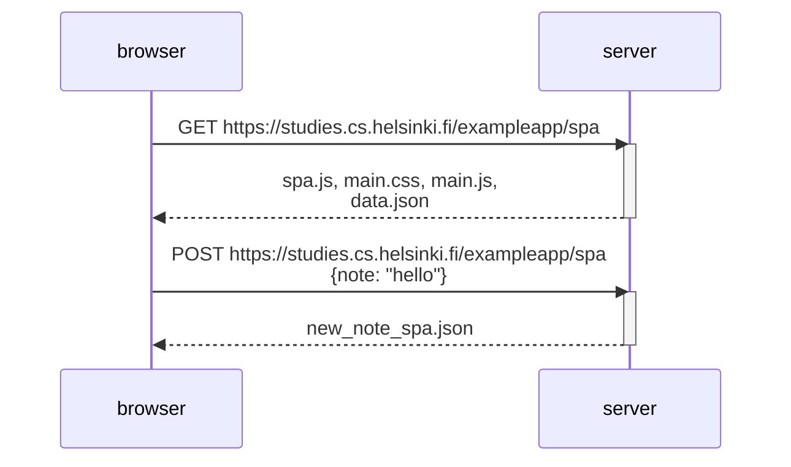

```mermaid
sequenceDiagram

participant browser
participant server

browser->>server: GET https://studies.cs.helsinki.fi/exampleapp/spa
activate server
server-->>browser: spa.js, main.css, main.js,<br>data.json
deactivate server

browser->>server: POST https://studies.cs.helsinki.fi/exampleapp/spa <br>{note: "hello"}
activate server
server-->>browser: new_note_spa.json
deactivate server
```
